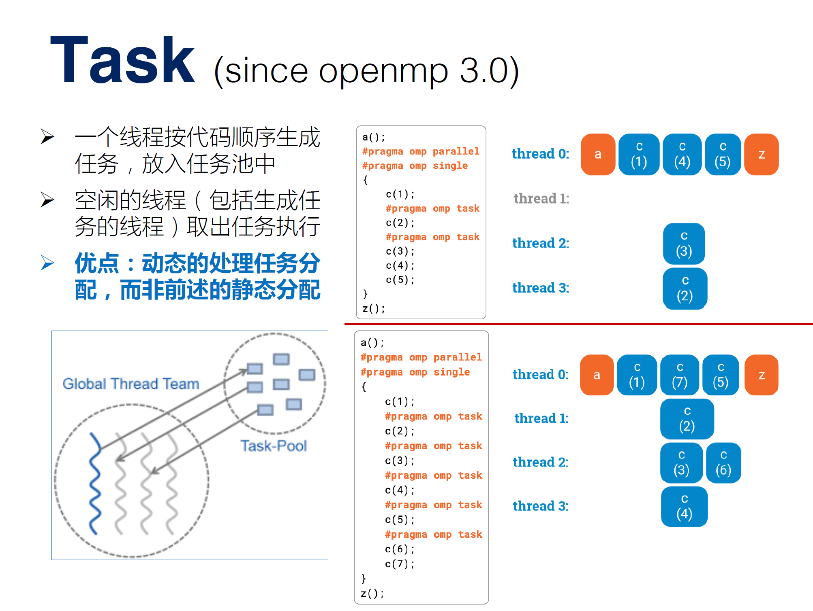
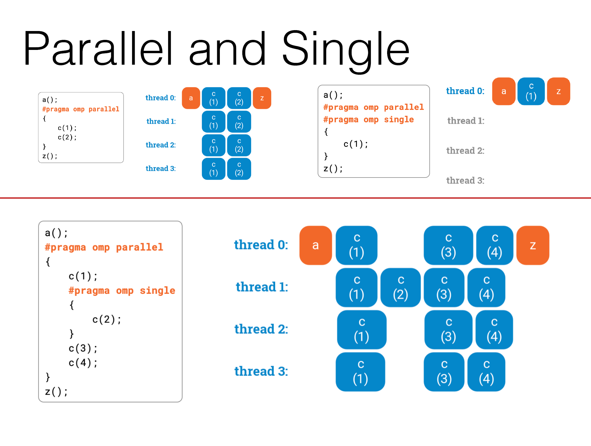

# `OpenMP`入门

## 目的
- 一种简单的方式, 让程序员不需要懂得创建和销毁线程就能写出多线程化程序
- 只需要告诉OpenMP哪里需要被线程化, 剩下的由OpenMP决定

## 核心
- 头文件 `#include <omp.h>`
- 编译
    - `g++ filename.cpp -fopenmp -o filename`
    - `gcc filename.c -fopenmp -o filename`
    - 好像`-fopenmp`和`--openmp`等价???
- 一般结构
    - 标记并行块 `#pragma omp parallel`
    - 标记单个并行单元 `#pragma omp single/for/section(s)/task`
    - 可以简写为 `#pragma omp parallel for` 等等
    - 外部设备 `#pragma omp target`
```C++
#include <omp.h>
int main() {
#pragma omp parallel
{
#pragma omp for
}
}
```
- `#pragma omp <directive> (clause[ [,] clause]...) {block}` 基本结构
    - `#pragma omp` 编译制导语句, 代码块周围要有 `{大括号}`
    - `#pragma omp parallel {}` 最**基本**的循环
    - `#pragma omp parallel for` 并行部分包含一个`for`**循环**
    - `#pragma omp critical` 并行部分的代码 每次只能由一个线程执行(等效于**取消并行**)
    - `#pragma omp barrier` 同步并行线程, 所有线程**等待**, 直到所有线程都执行到**本行**
    - `#pragma omp section` 将并行块内部的代码划分给线程组中的各个线程, 一般会在内部嵌套几个独立的`section`语句，可以使用`nowait`来停止等待
        - **没看懂**
- `omp_set/get_XXX` 函数
    - `void omp_set_num_threads(int)` 手动**设置**线程数(可以自动设置)
        - 或者通过`#pragma omp parallel num_threads(int)`进行设置 
    - `int omp_get_thread_num(void)` 获取当前线程的**编号**
    - `int omp_get_num_threads(void)` 获取线程**总数**
- 基础情况
```C++
#include <stdio.h>
#include <omp.h>
int main(int argc, char** argv) {
    int num_thread = 4;
	omp_set_num_threads(num_thread);    // 设定线程数
#pragma omp parallel num_threads(7)     // 然后改成7线程了
{
    int id = omp_get_thread_num();  // 查询本线程号
    printf("hello from thread%d\n",id);
}
    return 0;
}
```

## `for` 循环
- `#pragma omp parallel for`
- 使用"working share", 使每一个循环均可分配到不同的不同的线程, 并且保证只执行一次.
- 苛刻要求
    - 循环变量必须是整形`int` (`unsigned`就不行)
    - 循环比较条件必须是`<` `<=` `>` `>=`
        - 如果`<` `<=`, 则循环变量必须增加; 反之减小
        - 但是自己试了试好像`!=`也行???(但是教程的意思是不行)
    - 循环的第三个表达式, 必须是整数的加减, 且加减的值必须是循环不变量
        - 可以使用`++` `--`
    - 循环必须是单入口、单出
        - 也就是说循环内部不允许能够达到循环以外的跳转语句，`exit`除外
        - 异常的处理, 也必须在循环体内处理
        - 例如：若循环体内的`break`或`goto`会跳转到循环体外，那么会编译不通过。
    - 不通过例子 `for (unsigned int i = 0; i != 10; i = i+1) {}`
        - 但是好像通过了???
- 竞态条件: 每次迭代都依赖于另一个不同的迭代
    - 实际很难被编译器检测到, 只能重写或者选择不同算法
    - 通过合适修改消除竞态条件(第二段代码)
        - 尽量依赖循环变量进行更改, 保持引入的非内部参数不变
```C++
#pragma omp parallel for
    for (char i = 'a'; i <= 'z'; i++)   // i是循环变量
        std::cout << i << std::endl;    // 可以执行, 但是endl会冲
        fact[i] = i * fact[i-1];    // 不会报错, 但是会出错. 竞态条件
    return 0;
```
```C++
#pragma omp parallel for
    for (int i = 0; i < numElements; i++) {
        array[i] = initValue + i;   // pass
        // array[i] = initValue++;  // error
    }
```

## `shared` / `private` 共有和私有数据
- 分类
    - 共有`shared`: 所有线程访问的都是相同的内存地址
    - 私有`private`: 每个线程都有自己的一份拷贝
    - 默认情况下, 只有循环变量是私有, 其他变量默认共有
- 设定私有
    - 在循环内部声明变量, 注意`private`不能是`static`! 会冲突.
    - 通过OpenMP指令声明私有变量
```C++
    int temp, array[10];
#pragma omp parallel for private(temp) shared(array)
// 其实share(array)不写也没关系
    for (int i = 0; i < 10; i++) {
        temp = array[i];
        array[i] = doSomething(temp);
    }
```

## `Reductions` 归并
- 针对**累计运算**变量的循环
- 为每个线程提供了私有的可累加变量
- 线程退出时, 把每个线程的部分综合
- 可以自定义归并操作
|操作|`+` `-`|`*`|`&`|`|`|`^`|`&&`|`||`|
|私有临时变量初始值|0|1|~0|0|0|1 true|0 false|
```C++
    int sum = 0;
#pragma opm parallel for reduction(+:sum)
    for (int i = 0; i < 100; i++) {
        sum += array[i];
    }
```

## `schedule` 循环调度
- 用于`for`循环
- 希望实现负载均衡, 不出现空闲时间. 需要进行分配上的优化
    - 需要提供一些信息给OpenMP, 告知有可能的优化方式
    - 默认循环时间相同, 把不同迭代等分到不同核心上, 同时尽可能减小内存访问冲突
        - 内存访问为线性, 从这个角度出发, 建议把循环按顺序等分较好.
        - 但是有可能导致负载均衡降低
    - 所以需要综合考虑**内存访问**和**负载均衡**
- `#pragma omp parallel for schedule(<kind>, <chunk size>)`
    - `kind` = `dynamic` / `static` / `guided` / `runtime`
        - `static`:
            - 每个线程自行决定要执行哪块, 即每个线程执行`for`循环中的一个子块`<chunk>`(连续一坨要执行的迭代值)
            - 是`schedule`的默认值
            - 指定每次索取的子块大小`<chunk size>`, 默认1. 即按顺序线程按顺序每次索取`<chunk size>`个
        - `dynamic`:
            - 每次都向omp库索取一个迭代值, 因此线程有可能执行任意的迭代值, 而不是子块
            - 指定每次索取的子块大小`<chunk size>`, 默认1
            - 动态分配本身也有资源消耗, 所以需要制定子块大小
        - `guided`
            - 一种采用指导性的启发式自调度方法
            - 开始时每个线程会分配到较大的迭代块, 之后分配到的迭代块会逐渐递减
                - 迭代块的大小会按指数级下降到指定的`<chunk size>`大小
                - 如果没有指定`<chunk size>`参数, 那么迭代块大小最小会降到1
        - `runtime` (并不是真实调度方式)
            - 在运行时根据环境变量`OMP_SCHEDULE`来确定调度类型
            - 最终使用的调度类型仍然是上述三种调度方式中的某种
                - 例如在unix系统中, 可以使用setenv命令来设置OMP_SCHEDULE环境变量: `setenv OMP_SCHEDULE "dynamic, 2"`
                - 没搞懂在哪里用这句...
- 例子
    - `#pragma omp parallel for schedule(static)`
        - 等价于不加, `#pragma omp parallel for`的默认情况
    - `#pragma omp parallel for schedule(dynamic, 3)`
        - 并行, 动态分配, 每次索取三个迭代值
    - `#pragma omp parallel for schedule(guided, 4)`
        - 并行, 导引分配, 分配数从5降到4(为什么从5开始下降??)

## `collapse` 多层循环 (since openmp 3.0)
- 多层循环, 可以保持循环的层次
- 似乎只能是多层循环, 且两层循环**层间**不能有东西?
```C++
#pragma omp parallel for collapse(2)
    for (int i = 0; i < 3; i++) {
        for (int j = 0; j < 6; j++) {
            workintwocycles(i, j);
        }
        // 层间可以有东西吗?
    }
```

## `task` 单进程中多线程
- 一个线程按代码顺序生成任务, 放入任务池中
- 空闲的线程(包括生成任务的线程)取出任务执行
- 优点: 动态的处理任务分配, 而非前述的静态分配
- `#pragma ompp task` 用于single中
    - 图例



## `single` 仅进行一次



## `omp_lock_t` 锁
- 定义于`omp.h`, 等效于`mutex`
- 有5种操作
    - 初始化锁 `void omp_init_lock(omp_lock_t*)`
        - 初始化后锁处于未锁定状态
    - 销毁锁 `void omp_destroy_lock(omp_lock_t*)`
        - 调用这个函数时, 锁必须是未锁定状态
    - 获得锁 `void omp_set_lock(omp_lock_t*)`
        - 如果锁已经被其他线程加锁了, 那当前线程进入阻塞状态
    - 释放锁 `void omp_unset_lock(omp_lock_t*)`
        - 调用这个方法的线程必须已经获得了锁, 如果当前线程没有获得锁, 则会有未定义行为
    - 尝试获取锁 `int omp_test_lock(omp_lock_t*)`
        - 获取锁成功则返回1, 否则返回0
        - 该函数可以看作是`omp_set_lock`的非阻塞版本
- 例子
    - 只能有一个线程执行锁范围中的内容
```C++
#include <iostream>
#include <omp.h>
static omp_lock_t lock;
int main() {
    omp_init_lock(&lock); //初始化互斥锁
#pragma omp parallel for
    for(int i = 0; i < 5; ++i) {
        omp_set_lock(&lock);   //获得互斥器
        std::cout << omp_get_thread_num() << "+" << std::endl;
        std::cout << omp_get_thread_num() << "-" << std::endl;
        omp_unset_lock(&lock); //释放互斥器
    }
    omp_destroy_lock(&lock);  //销毁互斥器
    return 0;
}
```

## `sections` 局部并行/串行
- 一个`section`内的block必须串码运行, 不同`section`之间可以并行
- 如下, `parallel sections {}`调出, `section {}`指定串行内容
```C++
#pragma omp parallel sections
{
    {work1();}
#pragma omp section
    {work2();
    work3();}
#pragma omp section
    {work4();}
}
```

## `critical` 互斥
- 保证其内代码只在一个线程中执行
    - `#pragma omp critical {}`
- 可以给一个名字, `critical(criname)`
    - 相同名字的代码块们, 保证不会在多个线程中运行, 同一时间只会有一个在运行
    - 如果没有命名, 系统会自己给一个名称
```C++
#pragma omp critical(dataupdate)
{
datastructure.reorganize();
}
#pragma omp critical(dataupdate)
{
datastructure.reorganize_again();
}
```

## `atomic` 原子性
- 保证其后续的语句执行时原子性的, 即其执行不可拆分(要么执行成功, 要么什么都没有执行)
- 只能用于简单指令, 如`+=` `-=` `*=` `&=`等等
    - `counter = counter + value`
- 表达式中也不能够有函数调用, 数组索引等操作
    - (好菜啊)还是用critical吧
    - 但是估计是比较轻量级, 单单执行比`critical`节省时间

## `ordered` 保持顺序
- 用于控制一段代码在for循环中的执行顺序，它保证这段代码一定是按照for中的顺序依次执行的

## `barrier` 强制同步
- 强制等待全部线程都完成后再操作
- `#pragma omp barrier`

## `master`
- 只能由master线程在操作

## `flush`
- 共有变量: 在parallel之前的变量都在线程中被引用与操作, 为所有线程所共有. 但是由于线程可能在不同的处理器上处理, 所以可能存在延迟, 可强制更新共有变量(伪内存共享)

## `simd`
- 将循环转化为SIMD循环(矢量化)

## 例子
- 多线程执行展示

## 保留区
- 老师上课提到的`<directive>`
- `parallel` `for` `sections` `section` `critical` `atomic` `collapse`
- `parallel for` `parallel sections`
- `single` `master` `barrier` `flush` `threadprivate` `task` `simd` `target` `distribute` `teams` `cancel`
- 尽量减少一下使用
    - `critical` `atomic` `master` `barrier` `flush` `task` `threadprivate`
```C++```
```C++```
```C++```
```C++```


## 参考文献
- 比较基础: https://blog.csdn.net/YUNXIN221/article/details/103964460
- 全面一些: https://cloud.tencent.com/developer/article/1559465
- 讲得很全: http://www.uml.org.cn/c%2B%2B/201810291.asp
- 总结表格: https://www.cnblogs.com/liangliangh/p/3565136.html

## 图片